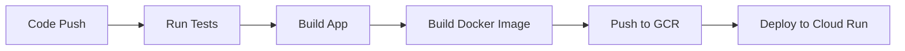

# Java CI/CD Demo Application

[](https://console.cloud.google.com/cloud-build/)
[](https://www.oracle.com/java/technologies/javase/javase8-archive-downloads.html)
[](https://spring.io/projects/spring-boot)
[](LICENSE)

**SIT707 Software Quality and Testing - HD Task**  
**Continuous Integration and Deployment (CI/CD) with Google Cloud Platform (GCP)**

## 📋 Table of Contents

- [Project Overview](#-project-overview)
- [Technology Stack](#-technology-stack)
- [Project Structure](#-project-structure)
- [Quick Start](#-quick-start)
- [Local Development](#-local-development)
- [Testing Strategy](#-testing-strategy)
- [CI/CD Pipeline](#-cicd-pipeline)
- [GCP Deployment](#-gcp-deployment)
- [API Documentation](#-api-documentation)
- [Troubleshooting](#-troubleshooting)
- [Contributing](#-contributing)

## 🚀 Project Overview

This is a Spring Boot-based User Management REST API application designed specifically for the SIT707 CI/CD practice task. The project demonstrates a complete continuous integration and continuous deployment workflow, including:

- **Automated Testing**: Contains both passing and failing test cases to demonstrate CI/CD processes
- **Google Cloud Build**: Automated build and deployment pipeline
- **Google Cloud Run**: Containerized deployment
- **GitHub Integration**: Code pushes automatically trigger CI/CD

### 🎯 Learning Objectives

- Master the configuration and usage of GCP CI/CD tools
- Understand the importance of automated testing in CI/CD
- Learn containerized deployment best practices
- Experience modern software development DevOps workflows

## 🛠 Technology Stack

| Technology | Version | Purpose |
|------------|---------|---------|
| Java | 8 | Programming Language |
| Spring Boot | 2.7.18 | Web Framework |
| Maven | 3.6.3 | Build Tool |
| JUnit 4 | 4.13.2 | Testing Framework |
| Docker | Latest | Containerization |
| Google Cloud Build | - | CI/CD Platform |
| Google Cloud Run | - | Deployment Platform |

## 📁 Project Structure

```
java-cicd-app/
├── src/
│   ├── main/
│   │   ├── java/com/example/cicd/
│   │   │   ├── CicdApplication.java          # Spring Boot Main Class
│   │   │   ├── controller/
│   │   │   │   └── UserController.java       # REST API Controller
│   │   │   ├── model/
│   │   │   │   └── User.java                 # User Entity Class
│   │   │   └── service/
│   │   │       └── UserService.java          # Business Logic Service
│   │   └── resources/
│   │       └── application.properties        # Application Configuration
│   └── test/
│       └── java/com/example/cicd/
│           └── controller/                   
│               └── UserControllerTest.java   # Controller Integration Tests
├── cloudbuild.yaml                           # GCP Build Configuration
├── Dockerfile                                # Docker Image Configuration
├── pom.xml                                   # Maven Project Configuration
└── README.md                                 # Project Documentation
```

## 🚀 Quick Start

### Prerequisites

- Java 8+
- Maven 3.6+
- Docker (Optional, for local container testing)
- Google Cloud Account
- GitHub Account

### 1. Clone the Project

```bash
git clone https://github.com/your-username/java-cicd-app.git
cd java-cicd-app
```

### 2. Run Locally

```bash
# Run tests
mvn clean test

# Start application
mvn spring-boot:run
```

The application will start at `http://localhost:8080`

### 3. Verify Deployment

```bash
# Health check
curl http://localhost:8080/api/users/health

# Get all users
curl http://localhost:8080/api/users
```

## 💻 Local Development

### Development Environment Setup

1. **IDE Recommendation**: IntelliJ IDEA or Eclipse
2. **Java Configuration**: Ensure using Java 8
3. **Maven Configuration**: Ensure using version 3.6+

### Running Tests

```bash
# Run all tests
mvn test

# Run specific test class
mvn test -Dtest=UserControllerTest

# Generate test reports
mvn surefire-report:report
```

### Hot Reload Development

```bash
# Enable development mode (supports hot reload)
mvn spring-boot:run -Dspring-boot.run.jvmArguments="-Dspring.profiles.active=dev"
```

## 🧪 Testing Strategy

The project contains three types of test cases specifically designed for CI/CD demonstration:

### ✅ Passing Tests
- `testGetAllUsers()` - Get user list
- `testGetUserById()` - Get user by ID
- `testCreateUserValid()` - Create valid user
- `testHealthCheck()` - Health check endpoint

### ❌ Intentionally Failing Tests (for CI/CD error handling demonstration)
- `testCreateUserWithInvalidData_WILL_FAIL()` - Expects 400 status but returns 200
- `testGetNonExistentUser_WILL_FAIL()` - Expects 404 status but returns 200
- `testUpdateUserExpectedBehavior_WILL_FAIL()` - Expects 201 status but returns 200

### 🔧 Fixed Tests
- `testGetNonExistentUser_FIXED()` - Correctly handles 404 situation
- `testCreateUserValidation_FIXED()` - Correct validation logic

### Test Reports

After running tests, detailed reports can be viewed at:
- JUnit Reports: `target/surefire-reports/`
- HTML Reports: `target/site/surefire-report.html`

## 🔄 CI/CD Pipeline

### Pipeline Stages

Our CI/CD pipeline consists of 5 main stages:



### 1. Test Stage
```yaml
- name: 'maven:3.6.3-openjdk-8'
  args: ['mvn', 'clean', 'test', '-B']
```
- Run all unit tests and integration tests
- Generate test reports
- Pipeline stops if tests fail

### 2. Build Stage
```yaml
- name: 'maven:3.6.3-openjdk-8'
  args: ['mvn', 'clean', 'package', '-DskipTests', '-B']
```
- Compile source code
- Create executable JAR file
- Only executes if tests pass

### 3. Docker Image Build
```yaml
- name: 'gcr.io/cloud-builders/docker'
  args: ['build', '-t', 'gcr.io/$PROJECT_ID/java-cicd-app:$COMMIT_SHA', '.']
```
- Create lightweight image based on Java 8 JRE
- Add health check functionality
- Run with non-root user

### 4. Image Push
```yaml
- name: 'gcr.io/cloud-builders/docker'
  args: ['push', '--all-tags', 'gcr.io/$PROJECT_ID/java-cicd-app']
```
- Push to Google Container Registry
- Support version tags and latest tag

### 5. Deploy to Cloud Run
```yaml
- name: 'gcr.io/cloud-builders/gcloud'
  args: ['run', 'deploy', 'java-cicd-app', '--image', '...']
```
- Automatically deploy to Google Cloud Run
- Configure memory and CPU resources
- Enable public access

## ☁️ GCP Deployment

### 1. GCP Project Setup

```bash
# Create new project
gcloud projects create your-project-id

# Set current project
gcloud config set project your-project-id

# Enable necessary APIs
gcloud services enable cloudbuild.googleapis.com
gcloud services enable run.googleapis.com
gcloud services enable containerregistry.googleapis.com
```

### 2. Cloud Build Configuration

1. **Connect GitHub Repository**
    - Visit Google Cloud Console > Cloud Build > Triggers
    - Click "Connect Repository"
    - Select GitHub and authorize
    - Select your repository

2. **Create Build Trigger**
   ```bash
   gcloud builds triggers create github \
     --repo-name=java-cicd-app \
     --repo-owner=your-username \
     --branch-pattern=main \
     --build-config=cloudbuild.yaml
   ```

### 3. Permission Configuration

Ensure Cloud Build service account has the following permissions:
- Cloud Run Admin
- Storage Admin
- Container Registry Service Agent

```bash
# Get Cloud Build service account
gcloud projects get-iam-policy your-project-id

# Add permissions
gcloud projects add-iam-policy-binding your-project-id \
  --member="serviceAccount:your-build-account" \
  --role="roles/run.admin"
```

### 4. Environment Variables

Set the following variables in Cloud Build:
- `PROJECT_ID`: Your GCP project ID
- `REGION`: Deployment region (e.g., us-central1)

## 📚 API Documentation

### Base URL
```
Local: http://localhost:8080/api/users
Production: https://your-app-url.run.app/api/users
```

### Endpoint List

#### User Management

| Method | Endpoint | Description | Request Body | Response |
|--------|----------|-------------|--------------|----------|
| GET | `/api/users` | Get all users | - | User list |
| GET | `/api/users/{id}` | Get user by ID | - | User object |
| POST | `/api/users` | Create new user | User object | Created user |
| PUT | `/api/users/{id}` | Update user | User object | Updated user |
| DELETE | `/api/users/{id}` | Delete user | - | Deletion status |

#### Query and Statistics

| Method | Endpoint | Description |
|--------|----------|-------------|
| GET | `/api/users/department/{dept}` | Get users by department |
| GET | `/api/users/stats` | Get user statistics |
| GET | `/api/users/health` | Health check |

### Request Examples

#### Create User
```bash
curl -X POST http://localhost:8080/api/users \
  -H "Content-Type: application/json" \
  -d '{
    "name": "John Smith",
    "email": "john.smith@example.com",
    "department": "Engineering"
  }'
```

#### Response Example
```json
{
  "user": {
    "id": 3,
    "name": "John Smith",
    "email": "john.smith@example.com",
    "department": "Engineering",
    "active": true
  },
  "message": "User created successfully"
}
```

### Error Handling

The application uses standard HTTP status codes:
- `200` - Success
- `400` - Bad Request
- `404` - Not Found
- `500` - Internal Server Error

Error response format:
```json
{
  "error": "Validation failed",
  "details": ["Name is required", "Email should be valid"]
}
```

## 🔧 Troubleshooting

### Common Issues and Solutions

#### 1. Build Failure
**Issue**: Maven build fails
```bash
# Solution: Clean and rebuild
mvn clean install -U
```

#### 2. Test Failures
**Issue**: Some test cases fail
```bash
# View detailed test reports
mvn test -Dmaven.test.failure.ignore=true
# Check target/surefire-reports/ directory
```

#### 3. Docker Build Issues
**Issue**: Docker image build fails
```bash
# Test Docker build locally
docker build -t java-cicd-app .
docker run -p 8080:8080 java-cicd-app
```

#### 4. GCP Permission Issues
**Issue**: Cloud Build insufficient permissions
```bash
# Check service account permissions
gcloud projects get-iam-policy your-project-id
# Add necessary permissions
gcloud projects add-iam-policy-binding your-project-id \
  --member="serviceAccount:xxx" --role="roles/run.admin"
```

#### 5. Application Startup Failure
**Issue**: Spring Boot application fails to start
```bash
# Check application logs
gcloud run logs read java-cicd-app --region=us-central1
```

### Debugging Tips

1. **Local Debugging**
   ```bash
   # Enable debug mode
   mvn spring-boot:run -Dspring-boot.run.jvmArguments="-Xdebug -Xrunjdwp:transport=dt_socket,server=y,suspend=n,address=5005"
   ```

2. **View Build Logs**
   ```bash
   # Cloud Build logs
   gcloud builds log your-build-id
   ```

3. **Container Debugging**
   ```bash
   # Enter container
   docker run -it --entrypoint /bin/bash java-cicd-app
   ```

**Note**: This project is developed as part of the SIT707 Software Quality and Testing course at Deakin University. It demonstrates practical implementation of CI/CD concepts using modern cloud technologies.

## 📚 Additional Resources

### Learning Materials
- [Spring Boot Official Documentation](https://spring.io/projects/spring-boot)
- [Google Cloud Build Documentation](https://cloud.google.com/build/docs)
- [Google Cloud Run Documentation](https://cloud.google.com/run/docs)
- [Maven Official Guide](https://maven.apache.org/guides/)

### Related Projects
- [Spring Boot Samples](https://github.com/spring-projects/spring-boot/tree/main/spring-boot-samples)
- [Google Cloud Samples](https://github.com/GoogleCloudPlatform/cloud-build-samples)

### Community Support
- [Stack Overflow - Spring Boot](https://stackoverflow.com/questions/tagged/spring-boot)
- [Google Cloud Community](https://cloud.google.com/community)
- [GitHub Discussions](https://github.com/your-username/java-cicd-app/discussions)

---